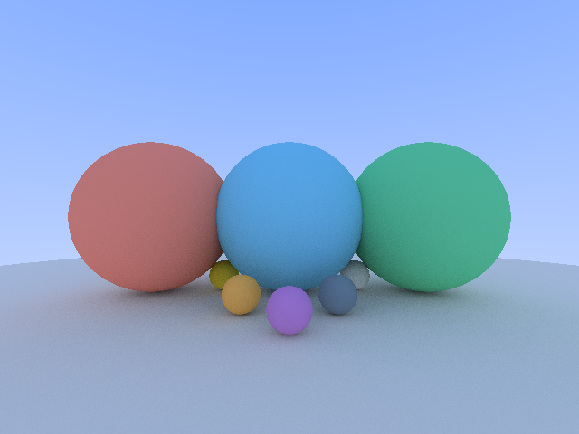

# Raytracing

## Description

Simple raytraced scene based on [RayTracing In One Weekend](https://raytracing.github.io/books/RayTracingInOneWeekend.html).

Image with 1000 samples per pixel and up to 100 ray bounces.

